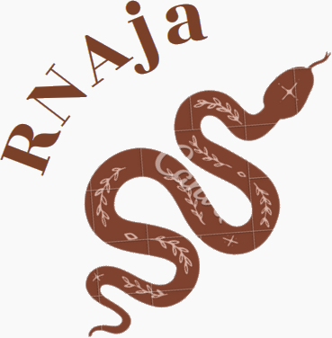

Welcome to RNAja's documentation!
=====================================

RNAseq pipeline.

Hisat2 : http://daehwankimlab.github.io/hisat2/

Stringtie : https://ccb.jhu.edu/software/stringtie/

EdgeR : https://www.bioconductor.org/packages/release/bioc/vignettes/edgeR/inst/doc/edgeRUsersGuide.pdf

.. toctree::
   :caption: Install
   :name: install
   :maxdepth: 2

   INSTALL.rst

.. toctree::
   :caption: Defining Workflows
   :name: defining_workflows
   :maxdepth: 2

   WORKFLOWS.rst

.. toctree::
   :caption: API
   :name: api_RNAja
   :maxdepth: 2

   click.rst

Indices and tables
==================

* :ref:`genindex`
* :ref:`modindex`
* :ref:`search`
